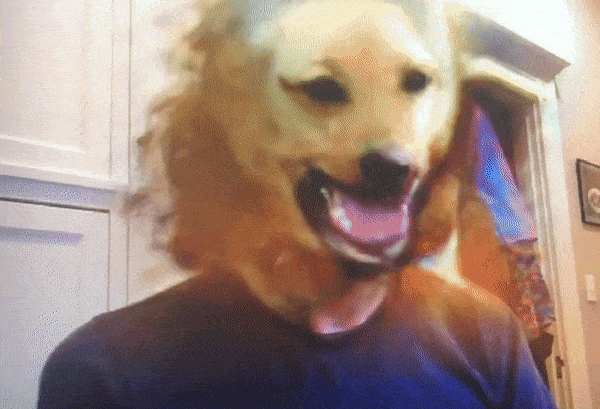

# MonsterMirror
### An electronic funhouse mirror that changes people into animals and monsters

Set this up for your haunted house at Halloween!  Amuse your guests as their faces are dynamically transformed into different animals and monsters in front of their eyes.  Watch the animals' faces and expression change as yours does.  Feed it different example animals and monsters to see what it can generate.




## How does it work?

It uses modern computer vision techniques based in deep learning to first locate any faces in the image, and then feed them through an encoder-decoder network to modify them into a new structure. For details see [this video about the FUNIT model](https://www.youtube.com/watch?v=kgPAqsC8PLM&feature=youtu.be) or the [project page](https://nvlabs.github.io/FUNIT/).


## How can I use it?

Please respect people's privacy when using this system.  This software must only be used for live performances.  Recording or transmission of the created media is not allowed without express written consent.  Moreover, the display must be in clear view of the people being captured.  For details, see the [license](LICENSE).

It will attempt to transform any faces it finds into "target" creatures you specify.  It will cycle through different target creatures, using examples in sub-directories of the `target-images` directory.  Feel free to play around with these yourself to see what it can and can't do.  The base model was trained mostly on dogs, so it will do best with those.  Setting the `scale_embedding` option can make it give a monster-like effect for targets it hasn't seen yet.  A `color_map` is a blunt but effective tool for making people look more monstery.  See `run-spooky.sh` and `run-furry.sh` for example configurations.  The "noise" parameters cause the neural network to explore variations on what you've set as the target, and will result in other animal types.

### System requirements

This has been tested on **Ubuntu** 18.04, and on **Mac OS X**.  It will run **much faster** with an **NVIDIA GPU** with CUDA to run the neural nets.  With a GPU, I see about 10 frames/sec (fps) which is fast enough to look like a mirror.  Without a GPU, I see about 1 fps on Ubuntu, and 0.2 fps on Mac.  

It _should_ work on **Windows**, but I don't have a windows box to test it on.  If you try it, [let me know](https://github.com/leopd/MonsterMirror/issues/1).  

### Installing

Setting up the python dependencies can be done lots of ways.  I like using conda and pip:

```
conda create -n monster_mirror python=3.6
conda activate monster_mirror
pip install -r requirements.txt
```

You must download the pre-trained models.  (Setup python first, since I use the `gdown` python library to download the GANimal model.)  To get the dependencies run

```
./download-pretrained.sh
```

Check that it's working with

```
pytest
```


### Running it

There are lots of (too many) options on the `localcam.py` file.  For some nice presets, try just running

```
./run-furry.sh  # animal faces
```

or

```
./run-furry.sh  # ghoulish monster look
```

You can modify each of these by adding extra arguments like

```
./run-furry.sh --no_full_screen --target_classes tiger,pomeranian
```

Drop your own images into new folders under the `target-images` directory to create new `target_classes`.  

To really dive in, see the full set of options with

```
./run-furry.sh --help
```


## Acknowledgements

This project copies the code in from two key dependencies.  (Git sub-modules are arguably the "correct" way to do this, but whenever I've tried to use sub-modules I've gotten very confused, and folks I know who have worked with them professionally have told me they're intrinsically broken.)

The key model in this software is the GANimal / FUNIT model from NVIDIA: [https://github.com/NVLabs/FUNIT](https://github.com/NVLabs/FUNIT) which is licensed [CC BY-NC-SA 4.0](https://creativecommons.org/licenses/by-nc-sa/4.0/).

* `sfd_pytorch` is used for face detection.  Originally from [clcarwin](https://github.com/clcarwin/SFD_pytorch) under MIT license.  I've cleaned up the code somewhat in [a fork](https://github.com/leopd/SFD_pytorch).

I'll give a plug for my library [timebudget](https://github.com/leopd/timebudget) which I built while writing MonsterMirror. I found it instrumental in understanding where the time was going, and helped me get this from 0.5 frames/sec up to about 10 fps.

Other depencies in `requirements.txt`.
